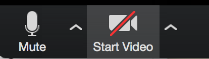
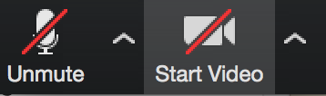

# Setting up For Success: Class Tools

## Exercise Objectives
* Familiarize yourself with Slack features
* Familiarize yourself with Zoom features
* Set up your work space

## Instructions
* Read through the guide below.
* Follow the prompts at the end.

### Menu:

- [Slack](#slack)
- [Zoom](#zoom)
- [Workspace Setup](#workspace)

#  Slack

[Slack](https://slack.com/) is a popular all-in-one messaging app that many teams use today. This will be our main source of communication.

With Slack you can:
  - Send direct messages (individual, group)
  - Upload files
  - Download for mobile

## Commonly Used Features

  1. Write messages. You can edit and delete messages instead of spamming the chat.
  2. Navigate channels. We'll provide a couple of channels for you.
    - **Main channel:** This is where lessons take place and announcements are made.
    - **Debugging channel:** All of your code issues and errors and questions go here. Offer help, suggestions, and solutions!
    - **Outcomes channel:** Your weekly graduation outcomes meetings take place in here.
    - **Partytime channel:** Giphys, emojis, fun links, funny stories. All the fun stuff goes here.
  3. Send direct messages to your peers and instructors.
  4. Use emojis :bowtie: to react to messages.
  5. Open and close the side menu. Here you will see any important "pinned" messages and links.

## Writing Code in Slack

Slack is really handy for sharing and formatting code. Here are 3 common ways to format it in Slack:

## Single Line of Code

- That's a back tick, not an apostrophe. You can find the back-tick above the `TAB` button on your keyboard:

## Multiple Lines (Blocks)

Same as single back ticks to format code, but you wrap the whole block of code in three back-ticks. To create new line breaks, type `shift` + `enter`.

## Code Snippet (Preferred*)

 

Sometimes using back-ticks messes up our code (Thanks Slack!) but you can **upload code files and snippets** by pressing the **`+`** sign in the message input field and select **Code or Snippet Text**.      

#  Zoom

[Zoom](zoom.us) is a video chat app. We will (all) be streaming throughout class hours. Zoom has a number of features we will use in class:

  - **Audio Controls:** You will mute/un-mute yourself when speaking. Be mindful if you forget to mute/un-mute yourself.
  - **Video Controls:** You will be on camera throughout class hours, so you can turn the video on and off for breaks.

   You're on mic.   
   You're muted and we can't hear you.    

  - **Screenshare:** The instructors will be sharing their screen so you can watch or follow along. When it's time for you to present something, or if you need help, we will ask you to screen share through Zoom.
    - Be careful what you screen share. Selecting Desktop will share your entire Desktop and we can see everything!
  - **Breakout rooms:** You will be assigned a breakout room for labs, stand up, and group work. This just creates an extra room for smaller group or pair work, instead of being in the main room.
  - **View modes:** There are a couple of ways to configure what you view:
    - Gallery View (shows a grid of everyone's faces)
    - Speaker View (the current speaker takes up the screen)
    - Dual View (you can disable the second window if you'd like by clicking on the little ^ symbol next to the "Start Video" as shown in the image above. Then go to Video Settings... and click "General")
    - Full screen (takes up the whole window. To turn off automatically expanding to a full screen, visit the "General" settings outlined above)

#  Workspace Setup

### It's imperative to STAY ORGANIZED!!

We suggest for your work setup:

   - Your laptop should just have Slack open. Lesson slides, screenshots, and content will live in here.
   - Your external monitor should have Zoom open. Set up your files neatly.
   - Once we get into more complex apps, it will be **crucial** to have an organized workspace and set up! We'll be dealing with a lot of windows.

- You will be on camera all day (with the exception of break times)
- Find a quiet spot. You will be talking a lot.
- Be mindful of your background. We can see everything behind you on camera.

## Prompts

There are no questions to answer here, but follow the prompts below.

Feel free to reference the guidelines above and perform the following actions in Slack:

1. In the main channel, navigate to the side panel. Look for a pinned message from Christine: "This will make sense later." Click on it, and give it a thumbs-up emoji reaction.
1. Right above the list of Channels, click on "All Threads". Find a thread and respond to it.
1. In the debugging channel, write a piece of code with single ticks: for example `var didThisWork = true;`.
1. In the debugging channel, write a block of code wrapped with triple ticks. Use `shift` + `enter` to create line breaks.
1. Go back and edit that block of code. You know you've successfully edited if you see your changes and a little _(edited)_ text.
1. In the debugging channel, upload a code snippet. Could be anything you like, single or multiple lines. It's basically a text file.
1. Take a picture of your computer workspace, like I did above.
1. In the debugging channel, upload your photo with the title "My workspace set up."
1. In the partytime channel post a giphy using `/giphy yay` (or a giphy keyword of your choice). Don't abuse `/giphy` please!
1. Send Christine a direct message with a giphy of your choice.
