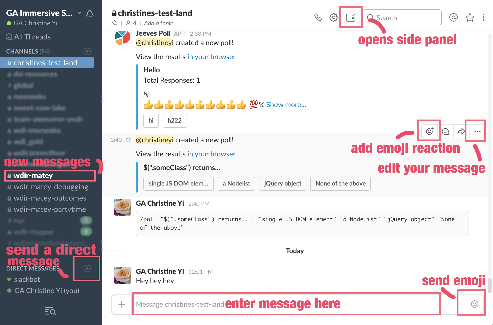
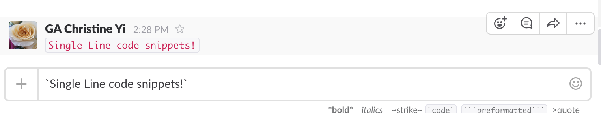
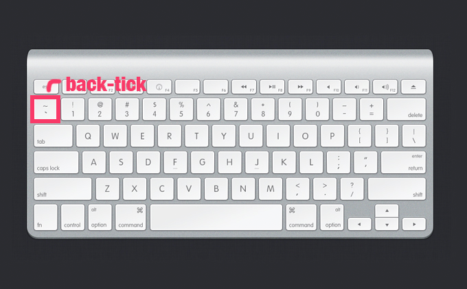
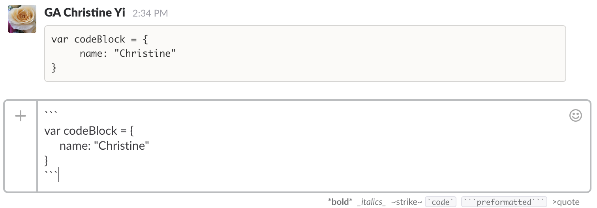
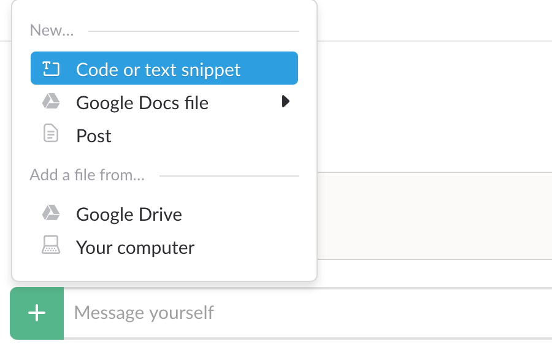
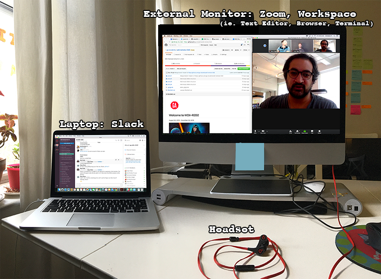

# Setting up For Success: Class Tools

### Menu:

- [Slack](#slack)
- [Zoom](#zoom)
- [Workspace Setup](#workspace)

#   Slack

[Slack](https://slack.com/) is a popular all-in-one messaging app that many teams use today. This will be our main source of communication.

With Slack you can:
  - Send direct messages (individual, group)
  - Upload files
  - Download for mobile

## Commonly Used Features

  1. Write messages. You can edit and delete messages instead of spamming the chat.
  2. Navigate channels. We'll provide a couple of channels for you.
    - **Main channel:** This is where lessons take place and announcements are made.
    - **Debugging channel:** All of your code issues and errors and questions go here. Offer help, suggestions, and solutions!
    - **Outcomes channel:** Your weekly graduation outcomes meetings take place in here.
    - **Partytime channel:** Giphys, emojis, fun links, funny stories. All the fun stuff goes here.
  3. Send direct messages to your peers and instructors.
  4. Use emojis :bowtie: to react to messages
  5. Open and close the side menu. Here you will see any important "pinned" messages and links

## Writing Code in Slack

Slack is really handy for sharing and formatting code. Here are 3 common ways to format it in Slack:

## Single Line of Code

- That's a back tick, not an apostrophe. You can find the back-tick above the `TAB` button on your keyboard:

## Multiple Lines (Blocks)

Same as single back ticks to format code, but you wrap the whole block of code in three back-ticks.

## Code Snippet (Preferred*)

 

Sometimes using back-ticks messes up our code (Thanks Slack!) but you can **upload code files and snippets** by pressing the **`+`** sign in the message input field and select **Code or Snippet Text**.  

#  Zoom

[Zoom](zoom.us) is a video chat app.

- mute
- breakout
- video settings (external screen)

#  Workspace Setup

### It's imperative to STAY ORGANIZED!!

We suggest for your work setup:

   - Your laptop should just have Slack open. Lesson slides, screenshots, and content will live in here.
   - Your external monitor should have Zoom open. Set up your files neatly.
   - Once we get into more complex apps, it will be **crucial** to have an organized workspace and set up! We'll be dealing with a lot of windows.

- You will be on camera all day (with the exception of break times)
- Find a quiet spot. You will be talking a lot.
- Be mindful of your background. We can see everything behind you on camera.
